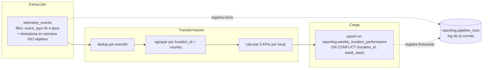

# Diseño — Pipeline de Desempeño de Negocio (Hito 6, Parte 1 de 3)

Diseño de un pipeline de datos nuevo que convierte la telemetría de inventario ya catalogada (`docs/telemetry/telemetry-plan.md`, `event-schemas.json`) en el **Reporte Semanal de Costo y Merma por Local** para Mariana (CEO) y Felipe (Director de Operaciones). Este documento es solo diseño — no hay código de orquestación todavía. La implementación llega en la Parte 2/3 de este hito.

`telemetry_events` sigue siendo la fuente, nunca el destino de este pipeline. El reporte técnico existente para ingeniería (`services/telemetry/analysis.py`, `GET /telemetry/report`) no se toca — este pipeline vive en módulos, tablas y endpoints completamente separados.

---

## 0. Estado real del sistema al momento de este diseño

Este pipeline se diseña sobre una base que, en el código de este monorepo, todavía **no existe como infraestructura corriendo**:

- **`telemetry_events` no es una tabla real hoy.** No hay ninguna configuración de Supabase en el repo. Project 6 entregó únicamente el catálogo de eventos (`docs/telemetry/telemetry-plan.md` + `event-schemas.json`, 18 eventos con Event Envelope y allowlists JSON Schema) — cero código de captura, almacenamiento o reporte técnico en `services/`. `services/telemetry/analysis.py` y `GET /telemetry/report` tampoco existen todavía en ningún lugar del repo.
- **Esto no bloquea este documento.** El rule de este hito pide explícitamente un diseño, no una implementación — se diseña *como si* `telemetry_events` ya existiera y estuviera poblada, exactamente como anticipa `telemetry-plan.md` §4 ("diséñalas como si alguien más, más adelante, fuera a depender de ellas"). Cuando la Parte 2 de este hito escriba código de orquestación real, la primera dependencia a resolver será esa infraestructura de captura — no algo que este documento resuelva.
- **El backend `/inventory` real tampoco existe** (`services/api/routes/` solo tiene `auth.py` y `suppliers.py`, bloqueado desde Hito 5). Los cuatro `event_type` de los que depende este pipeline (`inbound_order_created`, `stock_waste_registered`, `stock_threshold_triggered`, `ingredient_price_variance_detected`) no tienen hoy ningún punto de emisión real en código — son parte del catálogo diseñado, no de código instrumentado.
- **Gap de `country` heredado de Project 6, sin resolver aquí.** No existe modelo `Location` ni mapeo `location_id (1–14) → country` en el repo. El catálogo de telemetría ya resolvió esto a nivel de evento individual: `country` viaja como propiedad del propio evento, resuelta server-side al emitir (no se deriva vía join en este pipeline). Este pipeline hereda el riesgo — si `country` nunca se resuelve bien en el emisor porque `Location` nunca se construye, este pipeline agrega con un valor incorrecto o vacío — pero no lo resuelve; está fuera de su alcance.
- **Extensión de esquema aplicada como parte de este hito**: `inbound_order_created` y `stock_waste_registered` no traían ningún campo de costo en el catálogo original de Project 6. Se añadió `unit_cost` (`required`, `number`, `exclusiveMinimum: 0`) a ambos `propertiesSchema` en `event-schemas.json` — campo aditivo sobre un evento obligatorio existente, no un `event_type` nuevo (ver `telemetry-plan.md` §6, "Extensión aditiva — Hito 6 Parte 1"). Sin este campo, `total_purchase_cost` y `total_waste_cost` (§2.4) no serían calculables.
- **`outbound_order_created` queda fuera del alcance de extracción de la v1.** Es volumen operativo, no alimenta ninguno de los 5 KPIs de este reporte — se documenta como fuente potencial de v2 (detección de anomalías), no se extrae hoy.

---

## 1. Estado actual

**Lo que ya existe:** un catálogo de 18 eventos de telemetría diseñado (6 obligatorios del CONTEXT de negocio + 12 identificados), con Event Envelope y allowlists en JSON Schema draft-07 (`docs/telemetry/`). El reporte técnico que este catálogo alimentaría — volumen de eventos, tasa de error, latencia — responde preguntas de ingeniería para el propio equipo, no preguntas de negocio.

**La brecha:** nadie en Brasaland puede responder hoy, sin llamar a cada uno de los 14 locales, "¿qué local nos costó más esta semana en compras y merma, y cuál tiene el peor ratio merma/compra?". El reporte técnico no cierra esa brecha — no agrega por local, no calcula costos, y no tiene noción de "semana". Cerrarla requiere un pipeline dedicado que: (a) agregue temporalmente (semanal), (b) cruce cuatro tipos de evento distintos por local, y (c) persista un histórico semanal consultable, no un cálculo on-the-fly sobre logs crudos.

---

## 2. Diseño del pipeline

### 2.1 Propósito

> Producir el consolidado semanal de costo de compra, costo de merma, ratio de merma, quiebres de stock y alertas de precio por local (`reporting.weekly_location_performance`) que alimenta el Reporte Semanal de Costo y Merma de Mariana y Felipe, calculado sobre los eventos obligatorios `inbound_order_created`, `stock_waste_registered`, `stock_threshold_triggered` e `ingredient_price_variance_detected` de `telemetry_events`.

### 2.2 Formato y frecuencia de extracción

- Fuente única: `telemetry_events`, filtrada a los 4 `event_type` de 2.1. Formato: envelope + `properties` en JSON por fila, append-only — un evento nunca se edita una vez capturado.
- No se consulta ninguna otra tabla de dominio: no existen todavía tablas `Ingredient`/`IngredientEntry`/`IngredientExit` en Supabase (§0). Todo el dato necesario ya viaja en `properties` de cada evento, incluido `unit_cost`.
- Frecuencia: **corrida semanal**, disparada la madrugada del lunes. Ventana de extracción = semana ISO anterior completa (`week_start` = lunes UTC de esa semana, hasta el domingo siguiente inclusive).

### 2.3 Flujo de datos



### 2.4 Agregación

- **Grano:** una fila por `location_id` por semana ISO.
- **Dimensiones:** `location_id`, `country`, `week_start`.
- **Campos calculados** (cada uno mapea 1:1 a un KPI de negocio):
  - `total_purchase_cost` = Σ `quantity × unit_cost` de `inbound_order_created` de la semana, en la moneda del local.
  - `total_waste_cost` = Σ `quantity × unit_cost` de `stock_waste_registered` de la semana.
  - `waste_ratio` = `total_waste_cost / total_purchase_cost` (0 si no hubo compras esa semana — evita división por cero).
  - `stockout_events_count` = conteo de `stock_threshold_triggered` de la semana.
  - `price_alert_events_count` = conteo de `ingredient_price_variance_detected` de la semana.
  - `currency` = `COP` o `USD` según `country` (`CO`→`COP`, `US`→`USD`, misma convención `COUNTRY_CURRENCY` de `services/api/models.py`). **Nunca se convierte moneda en este pipeline** — locales `COP` y `USD` se reportan lado a lado, nunca sumados entre sí.

### 2.5 Estrategia de deduplicación / upsert (fuente que actualiza vs. inserta)

`telemetry_events` es append-only — el caso real de "actualización" es la propia tabla de **destino**, no el origen: una semana ya publicada puede necesitar recalcularse (evento tardío, corrección de un evento previamente mal emitido).

- Cada corrida **recalcula la semana completa desde cero** — vuelve a leer todo `telemetry_events` de esa ventana, vuelve a agregar, y hace `INSERT ... ON CONFLICT (location_id, week_start) DO UPDATE`. Nunca se suma un delta a un total ya guardado: eso es lo que garantiza que un recálculo (evento tardío incluido) no infle el número, solo lo corrige.
- Deduplicación de eventos individuales dentro de la etapa de transformación: por `eventId` (UUIDv4 del envelope), de forma defensiva — el pipeline no asume que la capa de captura (fuera de su alcance) ya garantizó unicidad.

### 2.6 Tabla de destino

Esquema dedicado `reporting`, nunca `telemetry_events`:

```sql
create table reporting.weekly_location_performance (
  id uuid primary key default gen_random_uuid(),
  location_id text not null,
  country text not null,
  week_start date not null,
  total_purchase_cost numeric not null default 0,
  total_waste_cost numeric not null default 0,
  waste_ratio numeric not null default 0,
  stockout_events_count integer not null default 0,
  price_alert_events_count integer not null default 0,
  currency text not null,
  computed_at timestamptz not null default now(),
  unique (location_id, week_start)
);
```

`unique (location_id, week_start)` es el constraint sobre el que se apoya el upsert de 2.5.

### 2.7 Endpoints nuevos (`services/reporting/`, separados de `services/telemetry/`)

| Endpoint | Método | Descripción |
|---|---|---|
| `/reporting/weekly-location-performance` | `GET` | Acepta `week_start` opcional (default: semana calculada más reciente). Lee directo de la tabla, no dispara el pipeline. |
| `/reporting/pipeline-runs/latest` | `GET` | Estado y metadata de la última corrida (reutilizable para pipelines futuros de `reporting`). |
| `/reporting/pipeline-runs` | `POST` | Dispara una corrida manual del flow. |

Ejemplo de respuesta de `GET /reporting/weekly-location-performance`:

```json
{
  "week_start": "2026-07-13",
  "locations": [
    {
      "location_id": "medellin-centro",
      "country": "CO",
      "total_purchase_cost": 8420000,
      "total_waste_cost": 610000,
      "waste_ratio": 0.072,
      "stockout_events_count": 2,
      "price_alert_events_count": 1,
      "currency": "COP"
    }
  ]
}
```

---

## 3. Resiliencia e idempotencia

### 3.1 Estrategia de idempotencia ante fallo en carga

Si el pipeline muere a mitad de la carga (algunas filas de `weekly_location_performance` ya escritas para esa semana, otras no): al reintentar, la corrida recalcula **la semana completa** desde `telemetry_events` — no continúa desde donde quedó — y vuelve a hacer upsert fila por fila con el mismo `ON CONFLICT (location_id, week_start) DO UPDATE`. Como cada fila se recalcula completa (nunca se incrementa), el resultado es idéntico al de una corrida limpia: las filas ya escritas se sobreescriben con el mismo valor, las que faltaban se insertan. No existe un estado "a medio insertar" que corrompa nada, porque cada `UPSERT` es atómico por fila.

### 3.2 Log de ejecución — `reporting.pipeline_runs`

```sql
create table reporting.pipeline_runs (
  id uuid primary key default gen_random_uuid(),
  pipeline_name text not null default 'weekly_location_performance',
  week_start date not null,
  started_at timestamptz not null,
  finished_at timestamptz,
  status text not null,              -- 'running' | 'completed' | 'failed'
  records_extracted integer,
  records_loaded integer,
  error_message text,
  triggered_by text not null         -- 'schedule' | 'manual'
);
```

| Campo | Por qué es necesario |
|---|---|
| `started_at` / `finished_at` | Permiten calcular duración y detectar corridas colgadas (`status='running'` sin `finished_at` tras N horas). |
| `records_extracted` vs. `records_loaded` | Divergencias inesperadas (ej. `records_loaded=0` con `records_extracted>0`) señalan un bug de transformación, no ausencia real de actividad. |
| `status` | Distingue `failed` de "nunca corrió" (ausencia total de fila para esa semana). |
| `error_message` | Diagnóstico sin depender de ir a buscar logs de Prefect por separado. |
| `triggered_by` | Distingue una corrida automática (cron semanal) de un disparo manual vía `POST /reporting/pipeline-runs`, útil para auditar recálculos fuera de calendario. |

---

## 4. Mapeo a Prefect

- **Flow principal:** `weekly_location_performance_flow(week_start: date | None = None)` — si `week_start` es `None`, calcula la semana ISO anterior a la fecha de corrida.
- **Tasks (mínimo 3, una por etapa):**
  1. `extract_telemetry_events(week_start) -> list[dict]` — query filtrado por `event_type` + rango de `timestamp`.
  2. `transform_weekly_aggregates(events: list[dict]) -> list[dict]` — dedup por `eventId`, agrupación por `location_id`, cálculo de los 5 KPIs (§2.4).
  3. `load_weekly_performance(rows: list[dict]) -> int` — upsert en `reporting.weekly_location_performance`, devuelve filas escritas.
  4. (soporte) `log_pipeline_run(...)` — escribe/actualiza la fila de `reporting.pipeline_runs` al inicio y al final del flow.
- **States relevantes:** `Running` (desde `extract_telemetry_events`), `Completed` (tras `load_weekly_performance` exitoso — dispara `log_pipeline_run` final con `status='completed'`), `Failed` (cualquier task levanta excepción — el flow captura el estado y `log_pipeline_run` registra `status='failed'` + `error_message`, vía hook `on_failure` o bloque `finally`).
- **Segundo flow:** fuera de alcance de la Parte 1 — opcional aquí, la Parte 3 lo exige al dividir en subflows.
- **Prefect blocks:** conexión a Supabase (string de conexión / credenciales como `Secret` block), reusado por `extract_telemetry_events` y `load_weekly_performance`. No se identifica ningún otro secreto nuevo en esta v1.

---

## 5. Integración con la aplicación

| Endpoint | Llama a (`data/pipelines/`) | Lógica de ETL en `services/`? |
|---|---|---|
| `GET /reporting/weekly-location-performance` | Función de solo lectura sobre `reporting.weekly_location_performance` | No — solo query |
| `GET /reporting/pipeline-runs/latest` | Función de solo lectura sobre `reporting.pipeline_runs` | No — solo query |
| `POST /reporting/pipeline-runs` | Dispara `weekly_location_performance_flow(...)` (deployment run de Prefect) | No — el endpoint invoca el flow y devuelve su run id |

Ninguna lógica de extracción/transformación/carga vive en `services/reporting/` — es una capa HTTP delgada sobre funciones y flows de `data/pipelines/`, el mismo patrón que ya separa `services/api/routes/` de la lógica de negocio hoy.

---

## 6. Riesgos y exclusiones

- **`telemetry_events` y el backend `/inventory` no existen como código corriendo hoy** (§0) — este documento diseña sobre una base asumida, no construida. Resolver esa base es prerequisito de la Parte 2/3, no de este documento.
- **`country` por local depende del modelo `Location` (Project 6, sin resolver)** — si nunca se construye, este pipeline agrega con un valor de `country` potencialmente incorrecto o vacío. Riesgo heredado, no resuelto aquí.
- **`outbound_order_created` excluido de v1** — es contexto operativo, no alimenta ningún KPI de este reporte. Candidato a v2 (detección de anomalías).
- **Conversión de moneda excluida de v1** — locales `COP` y `USD` se reportan siempre por separado; convertir a una sola moneda es trabajo de un futuro pipeline de reporting ejecutivo, no de este.
- **`services/telemetry/analysis.py` y `GET /telemetry/report` fuera de alcance** — no se modifican ni se leen desde este pipeline.
