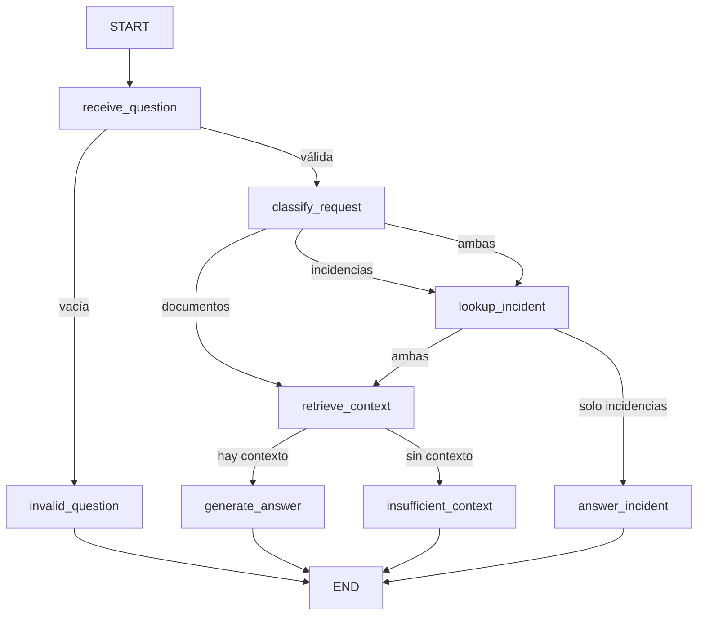

# Agente de soporte de Brasaland — base, MCP y memoria

El endpoint `POST /agent/query` ejecuta el agente LangGraph compilado al arrancar FastAPI. El grafo clasifica la petición entre RAG documental e incidencias consultadas por MCP. Para usuarios autenticados, el servicio añade memoria episódica aprobada según [memory-design.md](memory-design.md). `POST /knowledge/query` conserva su contrato anterior. Las secciones históricas de esta página documentan la base del Hito 7; el diseño de memoria detalla las extensiones actuales.

## Flujo y contratos



El estado contiene `question`, `context`, `decision`, `tool_result`, `memory_context`, `answer` y campos de resultado/error. `receive_question` reutiliza la normalización; `retrieve_context` llama una vez a `rag.retrieve`. Sin recuerdos pertinentes, los nodos RAG llaman a `rag.generate_answer`; con recuerdos, presentan documentos y recuerdos en bloques separados al mismo modelo. El nodo `insufficient_context` pasa una lista documental vacía. No hay llamadas a `rag.query()` dentro del grafo.

El constructor usa `StateGraph.compile()` y los nodos validan los contratos con Pydantic. La compilación verifica estructura, no garantiza por sí sola la validez de cualquier dato de ejecución. Las excepciones de proveedor no se copian en los artefactos públicos ni en las trazas.

La API acepta `{ "question": "...", "conversation_id": null }`. Para consultas anónimas devuelve `{ "answer": "..." }`; para usuarios autenticados devuelve también un `conversation_id` UUID que debe reenviarse en el siguiente turno. `X-Agent-Run-Id` correlaciona cada petición. Una pregunta vacía termina en 422; un fallo de recuperación, generación o persistencia devuelve 503. Los esquemas rechazan preguntas que no sean strings o excedan 1000 caracteres. El flujo es síncrono y FastAPI lo ejecuta en su pool de threads.

## Persistencia y trazas

La API abre un `SqliteSaver` en su ciclo de vida y cierra la conexión al parar. Una consulta anónima recibe un UUID nuevo como `thread_id`; las autenticadas reutilizan el `conversation_id` validado. Las preguntas autenticadas que coinciden con el filtro de datos excluidos se ejecutan sin checkpoint. La conexión permite acceso desde los threads de FastAPI; el saver coordina las operaciones. Se usan checkpoints síncronos y SQLite WAL. Esta configuración está pensada para desarrollo local; no resuelve despliegues distribuidos.

El directorio por defecto es `services/api/.agent-runtime/`; se puede cambiar con `AGENT_RUNTIME_DIR`. Contiene `checkpoints.sqlite`, `memory.sqlite` y `traces/<run_id>.json`. Están excluidos de Git y del contexto Docker. Con el bind mount actual de Compose persisten en el directorio del host; en un despliegue sin ese montaje debe montarse un volumen persistente.

Las trazas anónimas conservan las entradas y salidas observables de los nodos para las evaluaciones heredadas. Las trazas autenticadas registran la ruta, el estado y la procedencia sin pregunta, respuesta ni salidas crudas; las decisiones y hechos autorizados se auditan en `memory.sqlite`. No se registra razonamiento interno del modelo. Un error identifica el nodo y un código estable, sin copiar la excepción del proveedor.

La escritura usa un archivo temporal y reemplazo atómico por corrida. Si no se puede persistir, la consulta falla: no se afirma que existe una traza si el disco no permite guardarla. Una interrupción abrupta puede dejar una traza `running`; los evals la rechazan. Los checkpoints conservan los pasos guardados antes de la interrupción. No se expone una API pública para leer o reanudar corridas.

Desde la raíz del monorepo:

```bash
uv run --project services/api python scripts/inspect_agent_checkpoints.py <run-id>
```

La utilidad solo lee el historial del grafo; no llama a los proveedores. Para probar la persistencia entre reinicios, las pruebas cierran y reabren la base y comprueban el contexto antes de generación y la respuesta final.

## Instalar, ejecutar y comprobar

```bash
uv sync --project services/api
# Iniciar la API con su configuración habitual disponible
cd services/api
uv run uvicorn main:app --port 8000
```

En otra terminal:

```bash
curl -i http://localhost:8000/agent/query \
  -H 'Content-Type: application/json' \
  -d '{"question":"¿Cuántos puntos necesito para llegar al nivel Oro?"}'
```

El grafo reutiliza `LLM_API_KEY`, `LLM_BASE_URL`, `EMBEDDING_MODEL`, `GENERATION_MODEL` y `QDRANT_URL` del RAG. No añade otro proveedor ni exige cuenta de LangSmith. La colección `brasaland_knowledge` debe estar previamente indexada. No se reindexa automáticamente al iniciar.

Todos los comandos siguientes se ejecutan desde la raíz del monorepo:

```bash
# Tests aislados de RAG, grafo, endpoint y evals sobre fixtures guardadas
uv run --project services/api python -m pytest \
  tests/pipelines/test_rag.py tests/pipelines/test_support_agent.py \
  services/api/tests/test_agent.py tests/pipelines/test_agent_evals.py

# Capturar respuestas REALES, con configuración y Qdrant disponibles
uv run --project services/api python scripts/capture_agent_traces.py \
  --output-dir artifacts/agent-traces

# Evaluar las trazas ya guardadas: ninguna llamada de red ni ejecución del grafo
uv run --project services/api python -m pytest tests/pipelines/test_agent_evals.py \
  --agent-traces-dir artifacts/agent-traces

# Mantener la evaluación del retrieval previo (requiere proveedores reales)
uv run --project services/api python data/eval/recall_at_3.py
```

Los cuatro evals comprueban Oro, ausencia de contexto, entrada vacía y alérgenos. Comprueban rutas y hechos concretos; no constituyen una demostración universal de fidelidad semántica. Las respuestas reales deben revisarse junto con los chunks recuperados. Si la pregunta de horarios devuelve chunks irrelevantes en lugar de una lista vacía, el eval falla: se debe investigar el retrieval y su umbral, no fabricar una traza satisfactoria.

Sin `--agent-traces-dir`, los evals usan las cuatro trazas `mode=mock` versionadas en `tests/pipelines/fixtures/agent-traces/`. Se capturaron ejecutando el grafo real con recuperación y generación simuladas sobre el corpus. Sirven para CI y para verificar el evaluador, **no son evidencia de calidad del modelo real**. Con la opción explícita se exige `mode=live`; un directorio ausente o una traza incompleta provoca un fallo.

Para regenerar fixtures deliberadamente tras un cambio de formato:

```bash
uv run --project services/api python scripts/generate_agent_test_fixtures.py \
  --output-dir tests/pipelines/fixtures/agent-traces
```

No regenerarlas como parte automática de los evals: eso ocultaría regresiones y dejaría de ser evaluación offline.

## Entrega y limitaciones actuales

La implementación se realizó en la rama existente `feature/project-7-agent-support`. La validación real está pendiente: durante esta sesión no había `LLM_API_KEY` disponible. No se afirma un Recall@3 medido ni se modifica `MIN_SCORE=0.35` sin evidencia. El script de captura termina con un diagnóstico de configuración y no fabrica resultados.

Antes del PR final, capturar al menos una corrida completa real, ejecutar los evals offline sobre las cuatro corridas y el Recall@3 existente, revisar las respuestas y adjuntar export/captura más resultados. Preparar un PR propio con etiqueta `langgraph-agent-base`. Mantener fuera los cambios previos de `CLAUDE.md`.

Referencias técnicas: [Graph API](https://docs.langchain.com/oss/python/langgraph/graph-api) y [persistencia](https://docs.langchain.com/oss/python/langgraph/persistence). Dependencias fijadas en `services/api/uv.lock`; `requirements.txt` exportado para el Dockerfile existente.

## Comprobaciones de esta implementación

- 36 pruebas focalizadas pasaron (13 del RAG existente y 23 del agente/evals/endpoint).
- Build de sdist y wheel correcto; se verificó la inclusión de `support_agent/`.
- Suite ampliada: 118 pruebas pasaron inicialmente y 5 no pudieron abrir el servidor de Prefect dentro del sandbox. Los dos módulos afectados se repitieron con puertos locales permitidos: 10/10 pasaron, con un aviso de logging al cerrar Prefect y salida 0.
- Captura real: detenida antes de llamar al proveedor por ausencia de `LLM_API_KEY`.

### Actualización de validación real

La clave `LLM_API_KEY` ya está configurada y la aplicación la carga. La llamada real a embeddings responde HTTP 429 con `type=insufficient_quota` y `code=credit_balance_exhausted`. La validación real sigue pendiente de crédito del proveedor o acceso alternativo de la academia. No se cambiaron los modelos ni el umbral de recuperación.

Docker y Qdrant ya están arrancados y Qdrant responde en el puerto 6333. La colección `brasaland_knowledge` todavía no existe: cuando haya crédito, ejecutar la indexación del RAG antes de capturar las corridas del agente.
