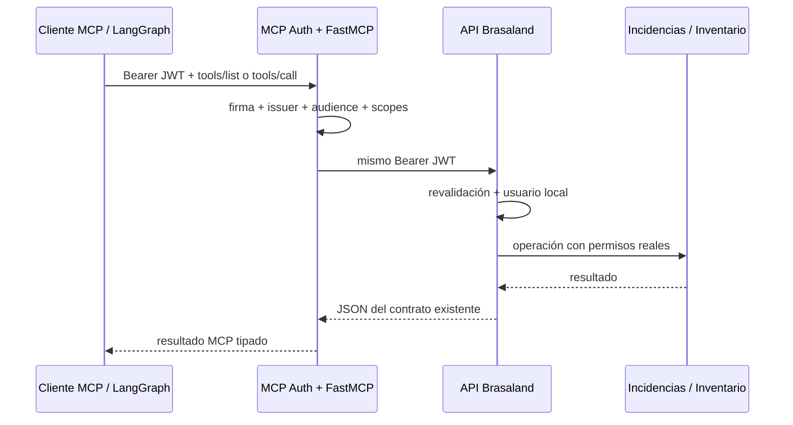

# Project 8 — servidor MCP de herramientas de Brasaland

## Decisión de transporte

El servidor usa **Streamable HTTP** en `/mcp`. El objetivo es que lo consuman el agente actual, MCP Playground y futuros clientes remotos; `stdio` limitaría el servidor al proceso que lo lanza y no permitiría el flujo OAuth HTTP requerido.

## Flujo de confianza

1. El cliente obtiene de un proveedor OAuth 2.1/OIDC un JWT para la audiencia exacta de `MCP_RESOURCE_URL`.
2. MCP Auth publica Protected Resource Metadata, valida firma, `iss`, `aud`, expiración y exige `mcp:access` antes de que FastMCP procese discovery o invocaciones.
3. Cada tool comprueba además su scope de negocio: `incidents:read`, `incidents:write` o `inventory:read`.
4. El servidor reenvía el mismo bearer a la API. La API vuelve a validar el JWT y lo mapea a un usuario local mediante `app_user_id`, `sub` numérico o `email`.
5. La API aplica propiedad de tickets y permisos persistidos de inventario. El MCP no acepta un `user_id` aportado por el cliente.



## Herramientas

| Tool | Scope | Efecto |
|---|---|---|
| `get_incident` | `incidents:read` | Lee un ticket propio. |
| `list_incidents` | `incidents:read` | Lista tickets propios con filtros. |
| `create_incident` | `incidents:write` | Crea un ticket propio. |
| `update_incident_status` | `incidents:write` | Usa exclusivamente `PATCH /api/incidents/{id}/status`. |
| `inventory_access` | `inventory:read` | Lee productos o movimientos; `operation=write` se rechaza antes de llamar a la API. |

Los esquemas de entrada y salida se derivan de Pydantic y aparecen en `tools/list`. Cada invocación registra `client`, `tool` y `result`, sin registrar tokens ni payloads.

## Configuración del proveedor

El proveedor debe soportar discovery OAuth/OIDC, JWKS, JWT access tokens, PKCE y una audiencia/resource para la URL pública del MCP. Configura en un archivo local ignorado por Git:

```dotenv
MCP_RESOURCE_URL=https://<codespace>-8010.app.github.dev/mcp
MCP_AUTH_ISSUER=https://<proveedor>/oidc
MCP_AUTH_TYPE=oidc
MCP_AUTH_JWKS_URI=https://<proveedor>/.well-known/jwks.json
COMPANY_API_URL=http://127.0.0.1:8000
MCP_URL=http://127.0.0.1:8010/mcp
```

No se incluye ningún secreto ni access token en el repositorio.

## Validación local y MCP Playground

Las pruebas automatizadas cubren discovery sin token (401), token sin scope base (403), schemas, scopes de tool, escritura de inventario rechazada, reenvío del token y endpoint de ciclo de vida de incidencias.

Para la validación manual exigida por la academia:

1. Arranca API y MCP con `docker compose up --build api mcp`.
2. En Codespaces, reenvía el puerto 8010 y cambia su visibilidad a pública.
3. Configura `MCP_RESOURCE_URL` con esa URL pública terminada en `/mcp` y registra la misma audiencia en el proveedor.
4. Conecta MCP Playground a esa URL, completa OAuth y ejecuta una vez cada tool.
5. Ejecuta `inventory_access` con `operation=write`; debe responder `inventory_read_only` y no debe aparecer una llamada de escritura en los logs de la API.

Playground no puede llamar a `localhost`; la prueba externa queda vinculada a la URL pública temporal del Codespace y a una cuenta real del proveedor.
